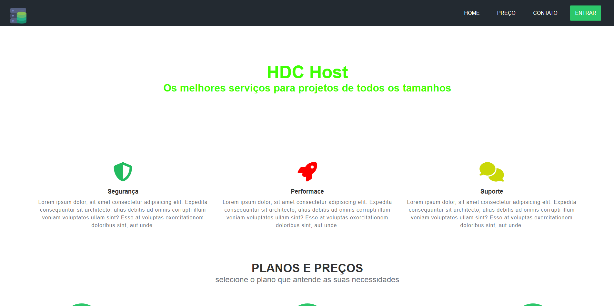

# HDC-Responsive

## Sobre o Projeto

Projeto responsivo desenvolvido para se adaptar a diferentes tipos de telas (desktop, tablet e mobile). Criado com o objetivo de promover a HDC Host, além de servir como prática para aprimorar habilidades de desenvolvimento front-end, focando em layouts flexíveis e experiência do usuário.

## Tecnologias Utilizadas

- HTML5
- CSS3 (com técnicas responsivas)

## Imagem do Projeto

## Como Executar

1. Abra o arquivo `index.html` no seu navegador.
2. Navegue pelas diferentes resoluções para ver a responsividade.

## 📄 Licença

Este projeto está sob a licença MIT.
